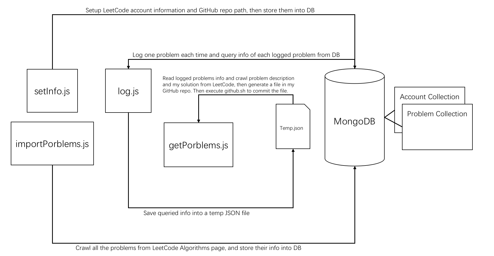

# Leetcode Helper

A small nodejs script that helps me crwaling problem descriptions and my solutions from leetcode, and saving the files in my local github repo, so I don't have to copy and paste from the website everytime I finished one problem.


### Current Modules and Functions:

1. setInfo : set Leetcode Account information and Github Local repo path.
2. importProblems : crawl problem infos from Leetcode, including problem id, problem title, problem link, etc.
3. Log : log problems I have finished.
4. getProblems : get the problem descriptions and my solutions from Leetcode and save them to the local repo path.
5. github.sh : a shell script to add, commit and push the new added file to my github.



### Node Modules used in this project 

- Prompt is to read the account information.


- Request is used to send GET http request to Leetcode problem list and  receive the respond json file.
- CasperJs is used as crawler, simulating the browser and user's behavior to login account in Leetcode and crawl my code.
- Cheerio is used in finding useful information from the HTML returned by CasperJS.
-  Mongodb used in helping query and insert problems and user information.

### Future improvment

- [ ] Directly commit the file to Github using Github API instead of saving it to local repo and commit to by shell commands.
- [ ] Save the information in a local json file instead of using a db.
- [x] Send Http request to crawl problems from Leetcode.
- [ ] Send Http request to login and crawl code from Leetcode instead of using CasperJS.
- [ ] Wrtie a front-end of this application, make it a web application using AngularJS as frontend and ExpressJS as backend.

### Problems Encountered

#### In Crawling:

1. At first, I tried to directly crawl HTML from LeetCode algorithm page, but got no content about problems, because the problems are asynchronous loaded by AJAX.

   First Solutio : Using CasperJS to simulate the browser to load AJAX data.

   **Final Solution** : Use network function in Chrome to check the data packet, and find the AJAX URL, and send http request to that URL. 

2. At first, I wanted to crawl my code after I finished one problem. My account in browser would be logged out ,because I logged in it in CasperJS to crawl my code. So, each time I crawl my code, my account will be logged off and I will have to login again to do the next problem.

   **Solution**: Instead of crawling one problem each time, I can use a logger to log the problems I just finished, so I can crawl them all at one time.

#### Ohter:

Callback Hell:

**Solution**:

```javascript
    Func1(args, (args) => {
      Func2(args)
   })
    Func2(args,(args) => {
      Func3(args)
    })
```

 

